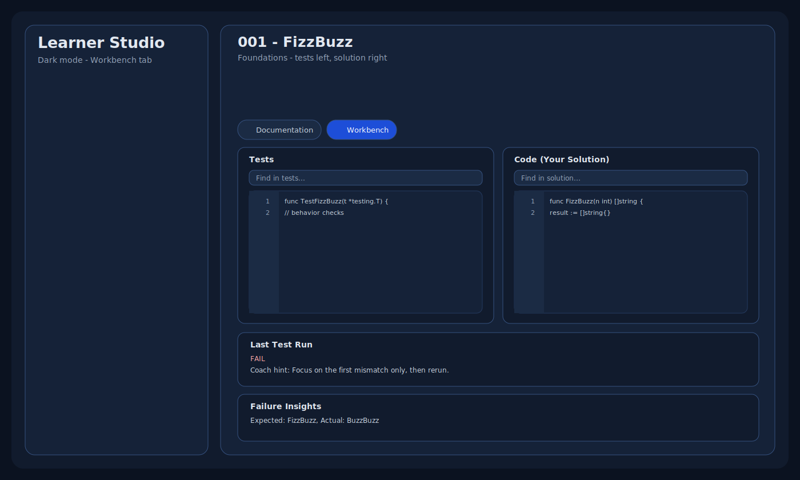

# Golang Katas Zero -> Senior (140 Katas)
[](https://github.com/ronappleton/golang-katas-1-100/actions/workflows/operability.yml)

Structured Go practice from first programming concepts through senior-level production design.

## Learning pathways

### 1) No Knowledge -> Junior
- Categories: `001-070`
- Modes: Documentation, Flashcards, Workbench, Quiz, Reflection
- Outcome: Build reliable function-level Go habits and boundary-safe basics.

### 2) Junior -> Mid
- Categories: `071-110`, `131-140`
- Modes: Documentation, Workbench, Bug Hunt, Quiz, Reflection
- Outcome: Build service/boundary confidence and debugging reliability.

### 3) Mid -> Senior
- Categories: `111-140`
- Modes: Documentation, Workbench, Bug Hunt, Flashcards, Quiz, Reflection
- Outcome: Apply advanced design, tooling, security, and operational tradeoffs.

Track details live in `tracks/go-core-100/track.json` and `tracks/go-core-100/pathways.json`.

## Curriculum categories

1. Starter: Programming Essentials (`001-010`)
2. Starter: Data and Logic (`011-020`)
3. Well-Known Packages (`021-030`)
4. Go Foundations (`031-040`)
5. Core Collections and Algorithms (`041-050`)
6. Text, Data, and Transformations (`051-062`)
7. File, Time, and Config (`063-070`)
8. Services and Boundaries (`071-090`)
9. Concurrency and Reliability (`091-110`)
10. Tooling, Security, and Advanced Design (`111-130`)
11. Bug Fix Lab (`131-135`)
12. Databases and I/O (`136-140`)

Full kata ordering is in `INDEX.md`.

## Learning apps

### CLI (`learner-cli`)
- list categories and progress
- run kata tests quickly
- generate AI marking packets


### Learner Studio (`learner-studio`)
Modes available:
- Documentation
- Workbench
- Flashcards
- Quiz
- Bug Hunt
- Reflection

#### Documentation tab

| Light mode | Dark mode |
|---|---|
|  |  |

#### Workbench tab

| Light mode | Dark mode |
|---|---|
|  |  |

#### Active learning modes

| Flashcards | Quiz | Focus mode |
|---|---|---|
|  |  |  |

### Desktop launch mode (`learner-desktop`)
- starts Learner Studio server
- opens app-style window on macOS/Linux/Windows
- no manual URL entry needed

## Quick start

```bash
# CLI
go run ./apps/learner-cli list
go run ./apps/learner-cli show --kata 001
go run ./apps/learner-cli run --kata 001

# Studio server mode
go run ./apps/learner-studio

# Desktop app mode
go run ./apps/learner-desktop
```

Build bundles:

```bash
./scripts/build_desktop_bundle.sh
```

## Operability checks

```bash
GOCACHE=$(pwd)/.gocache go test ./apps/learner-cli ./apps/learner-studio ./apps/learner-desktop ./internal/learning/...
./scripts/test_operability.sh
```

## Project structure

- `katas/kata-001-*` ... `katas/kata-140-*`
- `tracks/go-core-100/`
- `internal/learning/`
- `apps/learner-cli/`
- `apps/learner-studio/`
- `apps/learner-desktop/`
