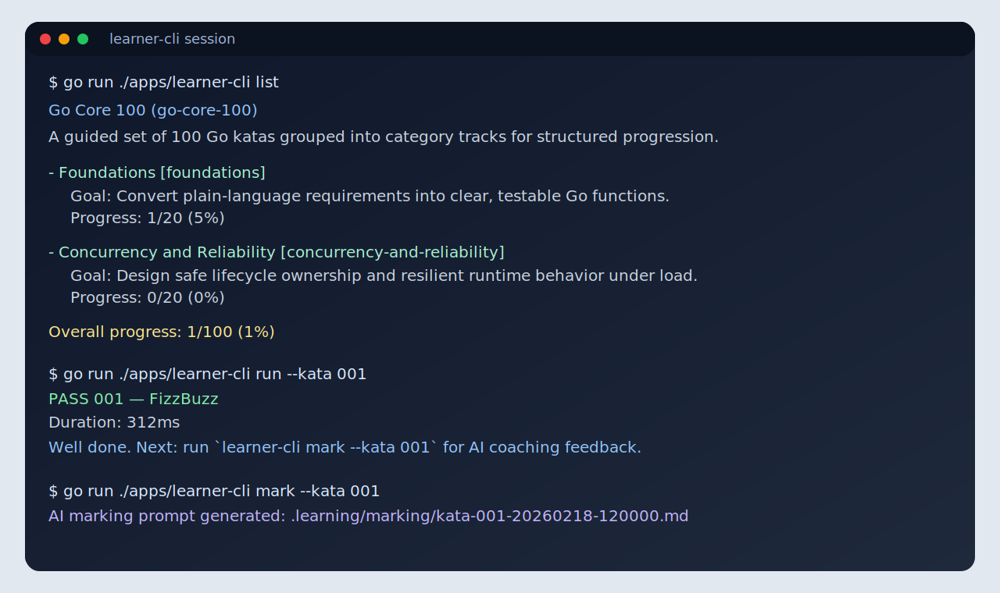

# Learner CLI

Purpose-built terminal workflow for disciplined Go kata practice.



## Why use it
- fast loop: list -> show -> run -> reflect
- no UI noise; ideal for focused sessions
- works well in CI, tmux, and remote dev setups
- keeps progress and marking artifacts versionable

## Core commands
From repo root:

```bash
go run ./apps/learner-cli list
go run ./apps/learner-cli katas --category starter-programming-essentials
go run ./apps/learner-cli show --kata 001
go run ./apps/learner-cli run --kata 001
go run ./apps/learner-cli mark --kata 001
```

## What each command gives you
- `list`: full track/category progress
- `katas`: kata list for a category
- `show`: task contract, rules, and current status for one kata
- `run`: test result + progress update
- `mark`: AI marking packet for structured feedback

## Data it writes
- progress: `.learning/progress.json`
- AI marking packets: `.learning/marking/*.md`

## Who this is best for
- learners who prefer keyboard-first flow
- engineers practicing in short, repeatable intervals
- mentors running group kata sessions in a shared terminal setup
