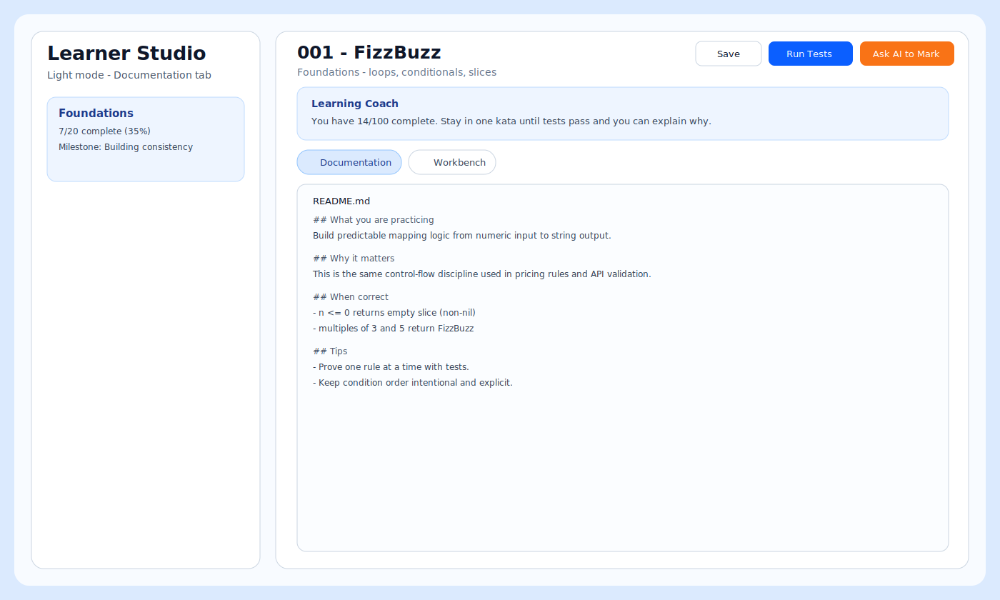
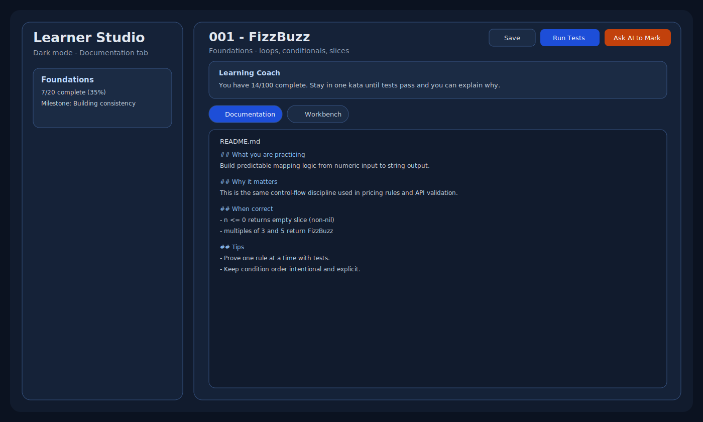
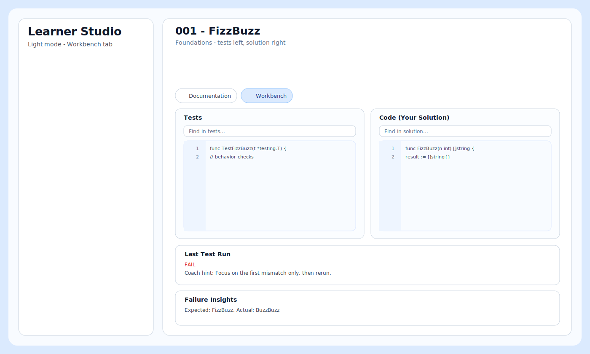
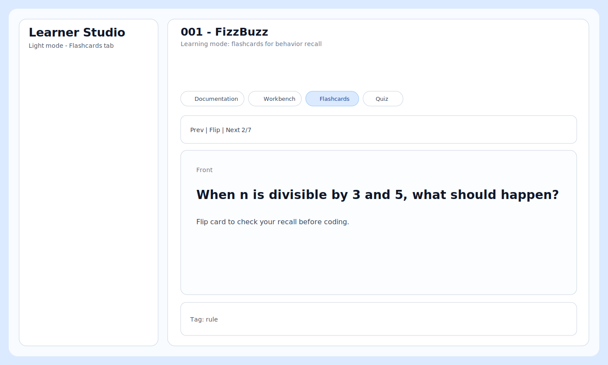
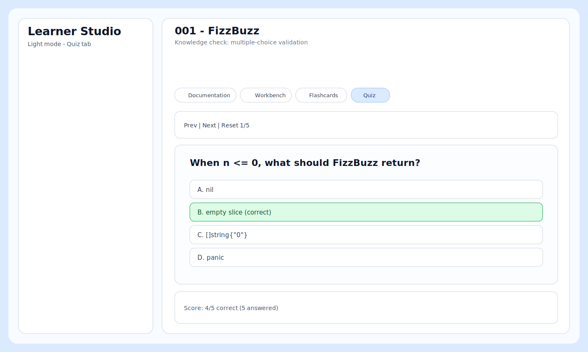
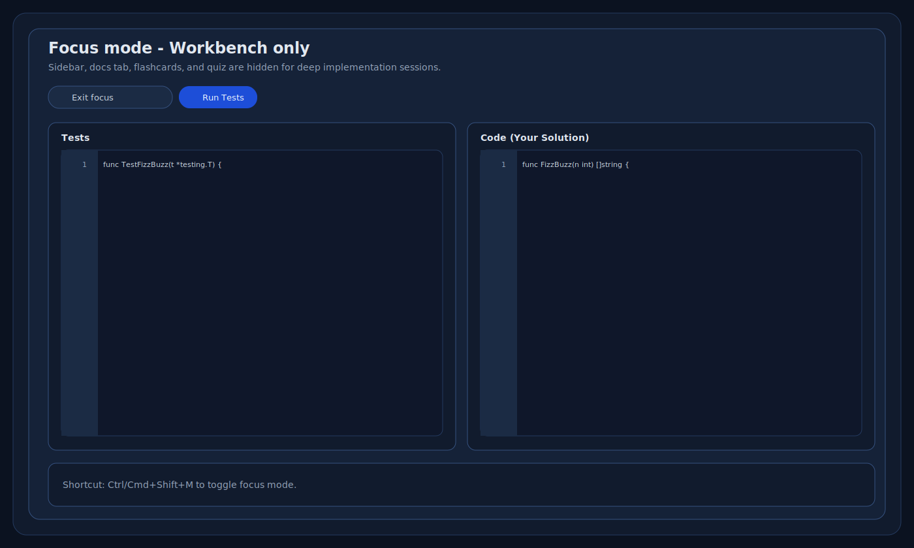

# Learner Studio

Local learning IDE for Go katas, optimized for understanding and iteration.

## What it is
Learner Studio gives the learner one place to read the contract, edit tests and code side-by-side, run diagnostics, and reflect before moving on.

## Learning modes
- `Documentation`: task, intent, rules, prior reading
- `Workbench`: tests on left, implementation on right
- `Flashcards`: recall behavior before coding
- `Quiz`: MCQ checks on contract understanding
- `Bug Hunt`: debug-first workflow for bug katas
- `Reflection`: save what failed first, what fixed it, and what to carry forward

## Key UX features
- light + dark mode
- focus mode (workbench-only layout)
- syntax highlighting, line numbers, in-editor search
- auto-format and keyboard shortcuts
- pathway progress + next-kata recommendations
- pass modal + AI marking handoff

## Screenshots

### Documentation (light/dark)
| Light | Dark |
|---|---|
|  |  |

### Workbench (light/dark)
| Light | Dark |
|---|---|
|  |  |

### Active modes
| Flashcards | Quiz | Focus mode |
|---|---|---|
|  |  |  |

## Run
From repo root:

```bash
go run ./apps/learner-studio
```

Open:

```text
http://127.0.0.1:7777
```

## Useful endpoints
- `GET /api/track`
- `GET /api/pathways`
- `GET /api/kata?id=<id>`
- `GET /api/learn?id=<id>`
- `POST /api/format`
- `POST /api/save`
- `POST /api/run`
- `POST /api/reset-buggy`
- `POST /api/mark`
